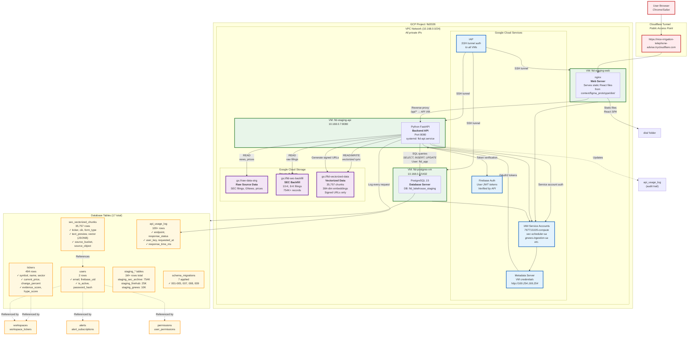

# Technical Architecture Diagram

```mermaid
graph TB
    %% External users
    USER[User Browser<br/><i>Chrome/Safari</i>] --> CF_TUNNEL

    %% Cloudflare Tunnel Layer
    subgraph CF_LAYER["Cloudflare Tunnel<br/><i>Public Access Point</i>"]
        CF_TUNNEL["https://nice-irrigation-<br/>telephone-<br/>advise.trycloudflare.com"]
    end

    %% GCP Project Boundary
    subgraph GCP["GCP Project: ftd2026<br/>us-west2-a"]
        direction TB

        %% === NETWORK LAYER ===
        subgraph VPC["VPC Network (10.168.0.0/24)<br/><i>All private IPs</i>"]
            direction LR

            %% === WEB TIER ===
            subgraph WEB_VM["VM: ftd-staging-web<br/>10.168.0.6:8080"]
                NGINX["nginx<br/><b>Web Server</b><br/>Serves static React files<br/>from context/figma_prototype/dist/"]
            end

            %% === API TIER ===
            subgraph API_VM["VM: ftd-staging-api<br/>10.168.0.7:8080"]
                FASTAPI["Python FastAPI<br/><b>Backend API</b><br/>Port 8080<br/>systemd: ftd-api.service"]
            end

            %% === DATABASE TIER ===
            subgraph DB_VM["VM: ftd-postgres-vm<br/>10.168.0.3:5432"]
                POSTGRES["PostgreSQL 15<br/><b>Database Server</b><br/>DB: ftd_lakehouse_staging"]
            end

            %% === GCP SERVICES ===
            subgraph GCP_SERVICES["Google Cloud Services"]
                IAM_SA["IAM Service Accounts<br/><i>767713105-compute<br/>sec-scheduler-sa<br/>gnews-ingestion-sa<br/>etc.</i>"]
                FIRESTORE["Firebase Auth<br/><i>User JWT tokens<br/>Verified by API</i>"]
                IAP["IAP<br/><i>SSH tunnel auth<br/>to all VMs</i>"]
                METADATA["Metadata Server<br/><i>VM credentials<br/>http://169.254.169.254"]
            end

            %% === STORAGE LAYER ===
            subgraph BUCKETS["Google Cloud Storage<br/><i>Private Buckets</i>"]
                BUCKET_RAW["gs://raw-data-strg<br/><b>Raw Source Data</b><br/>SEC filings, GNews, prices"]
                BUCKET_BACKFILL["gs://ftd-sec-backfill<br/><b>SEC Backfill</b><br/>10-K, 8-K filings<br/>754K+ records"]
                BUCKET_VEC["gs://ftd-vectorized-data<br/><b>Vectorized Data</b><br/>35,757 chunks<br/>384-dim embeddings<br/>Signed URLs only"]
            end
        end
    end

    %% DATA STORES (PostgreSQL tables inside DB_VM)
    subgraph TABLES["Database Tables (17 total)"]
        SEC_CHUNKS["sec_vectorized_chunks<br/>35,757 rows<br/>✓ ticker, cik, form_type<br/>✓ text_preview, vector (JSONB)<br/>✓ source_bucket, source_object"]
        TICKERS["tickers<br/>494 rows<br/>✓ symbol, name, sector<br/>✓ current_price, change_percent<br/>✓ evidence_score, hype_score"]
        USERS["users<br/>2 rows<br/>✓ email, firebase_uid<br/>✓ is_active, password_hash"]
        STAGING["staging_* tables<br/>1M+ rows total<br/>staging_sec_archive: 754K<br/>staging_finnhub: 25K<br/>staging_gnews: 10K"]
        AUDIT["api_usage_log<br/>109+ rows<br/>✓ endpoint, response_status<br/>✓ user_key, requested_at<br/>✓ response_time_ms"]
        MIGRATIONS["schema_migrations<br/>7 applied<br/>✓ 001-005, 007, 008, 009"]
    end

    %% DATA FLOW CONNECTIONS
    %% User traffic
    CF_TUNNEL --> NGINX
    NGINX -->|Static files<br/><i>React SPA</i>| REACT_DIST["dist/ folder"]
    NGINX -->|Reverse proxy<br/><i>/api/* → API VM</i>| FASTAPI

    %% API to Database
    FASTAPI -->|SQL queries<br/><i>SELECT, INSERT, UPDATE</i><br/>User: ftd_app| POSTGRES

    %% API to GCP Services
    FASTAPI -->|Token verification| FIRESTORE
    FASTAPI -->|Service account auth| IAM_SA
    FASTAPI -->|Log every request| AUDIT

    %% API to Storage
    FASTAPI -->|READ/WRITE<br/><i>vectorized sync</i>| BUCKET_VEC
    FASTAPI -->|READ<br/><i>raw filings</i>| BUCKET_BACKFILL
    FASTAPI -->|READ<br/><i>news, prices</i>| BUCKET_RAW
    FASTAPI -->|Generate signed URLs| BUCKET_VEC

    %% Admin access
    IAP -->|SSH tunnel| WEB_VM
    IAP -->|SSH tunnel| API_VM
    IAP -->|SSH tunnel| DB_VM

    %% VM to Services
    WEB_VM --> IAM_SA
    API_VM --> IAM_SA
    DB_VM --> IAM_SA
    IAM_SA --> METADATA
    METADATA -->|OAuth2 tokens| API_VM

    %% Tables inside PostgreSQL
    POSTGRES --> TABLES

    %% Table relationships (inside PostgreSQL)
    SEC_CHUNKS -.->|References| USERS
    TICKERS -.->|Referenced by| WS["workspaces<br/>workspace_tickers"]
    USERS -.->|Referenced by| WS
    USERS -.->|Referenced by| ALERTS["alerts<br/>alert_subscriptions"]
    USERS -.->|Referenced by| PERMS["permissions<br/>user_permissions"]
    FASTAPI -.->|Updates| API_LOG["api_usage_log<br/>(audit trail)"]

    %% Styling
    classDef vm_style fill:#e8f5e9,stroke:#2e7d32,stroke-width:3px
    classDef svc_style fill:#e3f2fd,stroke:#1565c0,stroke-width:3px
    classDef bucket_style fill:#f3e5f5,stroke:#6a1b9a,stroke-width:3px
    classDef table_style fill:#fff8e1,stroke:#ff8f00,stroke-width:2px
    classDef ext_style fill:#ffebee,stroke:#c62828,stroke-width:3px

    class WEB_VM,API_VM,DB_VM vm_style
    class IAM_SA,FIRESTORE,IAP,METADATA svc_style
    class BUCKET_RAW,BUCKET_BACKFILL,BUCKET_VEC bucket_style
    class SEC_CHUNKS,TICKERS,USERS,STAGING,AUDIT,MIGRATIONS,WS,ALERTS,PERMS table_style
    class CF_TUNNEL,USER ext_style
```
